ggplot2\_tutorial\_2017
================
Chad Fibke
2017-10-13

``` r
library(tidyverse)
```

    ## Loading tidyverse: ggplot2
    ## Loading tidyverse: tibble
    ## Loading tidyverse: tidyr
    ## Loading tidyverse: readr
    ## Loading tidyverse: purrr
    ## Loading tidyverse: dplyr

    ## Conflicts with tidy packages ----------------------------------------------

    ## filter(): dplyr, stats
    ## lag():    dplyr, stats

``` r
library(gapminder)
library(RColorBrewer)
```

Day.1 Oct13
===========

``` r
summary(mpg)
```

    ##  manufacturer          model               displ            year     
    ##  Length:234         Length:234         Min.   :1.600   Min.   :1999  
    ##  Class :character   Class :character   1st Qu.:2.400   1st Qu.:1999  
    ##  Mode  :character   Mode  :character   Median :3.300   Median :2004  
    ##                                        Mean   :3.472   Mean   :2004  
    ##                                        3rd Qu.:4.600   3rd Qu.:2008  
    ##                                        Max.   :7.000   Max.   :2008  
    ##       cyl           trans               drv                 cty       
    ##  Min.   :4.000   Length:234         Length:234         Min.   : 9.00  
    ##  1st Qu.:4.000   Class :character   Class :character   1st Qu.:14.00  
    ##  Median :6.000   Mode  :character   Mode  :character   Median :17.00  
    ##  Mean   :5.889                                         Mean   :16.86  
    ##  3rd Qu.:8.000                                         3rd Qu.:19.00  
    ##  Max.   :8.000                                         Max.   :35.00  
    ##       hwy             fl               class          
    ##  Min.   :12.00   Length:234         Length:234        
    ##  1st Qu.:18.00   Class :character   Class :character  
    ##  Median :24.00   Mode  :character   Mode  :character  
    ##  Mean   :23.44                                        
    ##  3rd Qu.:27.00                                        
    ##  Max.   :44.00

``` r
glimpse(mpg)
```

    ## Observations: 234
    ## Variables: 11
    ## $ manufacturer <chr> "audi", "audi", "audi", "audi", "audi", "audi", "...
    ## $ model        <chr> "a4", "a4", "a4", "a4", "a4", "a4", "a4", "a4 qua...
    ## $ displ        <dbl> 1.8, 1.8, 2.0, 2.0, 2.8, 2.8, 3.1, 1.8, 1.8, 2.0,...
    ## $ year         <int> 1999, 1999, 2008, 2008, 1999, 1999, 2008, 1999, 1...
    ## $ cyl          <int> 4, 4, 4, 4, 6, 6, 6, 4, 4, 4, 4, 6, 6, 6, 6, 6, 6...
    ## $ trans        <chr> "auto(l5)", "manual(m5)", "manual(m6)", "auto(av)...
    ## $ drv          <chr> "f", "f", "f", "f", "f", "f", "f", "4", "4", "4",...
    ## $ cty          <int> 18, 21, 20, 21, 16, 18, 18, 18, 16, 20, 19, 15, 1...
    ## $ hwy          <int> 29, 29, 31, 30, 26, 26, 27, 26, 25, 28, 27, 25, 2...
    ## $ fl           <chr> "p", "p", "p", "p", "p", "p", "p", "p", "p", "p",...
    ## $ class        <chr> "compact", "compact", "compact", "compact", "comp...

``` r
??mpg
mpg %>% 
  ggplot(aes( x = displ, y = cty))+ 
  geom_point()+
  theme_classic()+
  geom_rect(aes(xmin = 3, xmax = 4, ymin = 15, ymax = 20), alpha = 0.0001, color = "red")
```

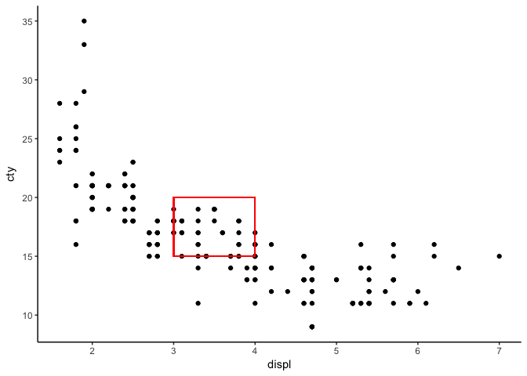

``` r
# This can help to highlight any data!

#xmin - (required) left edge of rectangle
#xmax - (required) right edge of rectangle
#ymin - (required) bottom edge of rectangle
#ymax - (required) top edge of rectangle
#size - (default: 0.5) line width of the rectangle's outline
#linetype - (default: 1=solid) line type of the rectangle's outline
#color - (default: NA=no outline) color of the rectangle's outline
#fill - (default: "grey20") fill color of the rectangle
#alpha - (default: 1=opaque) transparency of the rectangle's fil
```

``` r
mpg %>% 
  ggplot(aes(x = displ, y = class, color = trans))+
  geom_point()+
  facet_wrap(~class)
```


``` r
#dimonds and cuts
glimpse(diamonds)   
```

    ## Observations: 53,940
    ## Variables: 10
    ## $ carat   <dbl> 0.23, 0.21, 0.23, 0.29, 0.31, 0.24, 0.24, 0.26, 0.22, ...
    ## $ cut     <ord> Ideal, Premium, Good, Premium, Good, Very Good, Very G...
    ## $ color   <ord> E, E, E, I, J, J, I, H, E, H, J, J, F, J, E, E, I, J, ...
    ## $ clarity <ord> SI2, SI1, VS1, VS2, SI2, VVS2, VVS1, SI1, VS2, VS1, SI...
    ## $ depth   <dbl> 61.5, 59.8, 56.9, 62.4, 63.3, 62.8, 62.3, 61.9, 65.1, ...
    ## $ table   <dbl> 55, 61, 65, 58, 58, 57, 57, 55, 61, 61, 55, 56, 61, 54...
    ## $ price   <int> 326, 326, 327, 334, 335, 336, 336, 337, 337, 338, 339,...
    ## $ x       <dbl> 3.95, 3.89, 4.05, 4.20, 4.34, 3.94, 3.95, 4.07, 3.87, ...
    ## $ y       <dbl> 3.98, 3.84, 4.07, 4.23, 4.35, 3.96, 3.98, 4.11, 3.78, ...
    ## $ z       <dbl> 2.43, 2.31, 2.31, 2.63, 2.75, 2.48, 2.47, 2.53, 2.49, ...

``` r
# so we will use a bar chart if we are looking at cut
diamonds %>% 
  ggplot(aes(x = cut, y = price))+
  geom_boxplot(aes(fill = cut))+
  theme_classic()+
  facet_wrap(~cut, scales = "free")
```

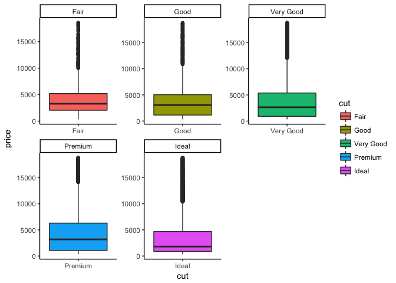

``` r
diamonds %>% 
  ggplot(aes(x = cut))+
  geom_bar(aes(fill = cut))+
  theme_classic()+
  theme(legend.box.background = element_rect()) 
```

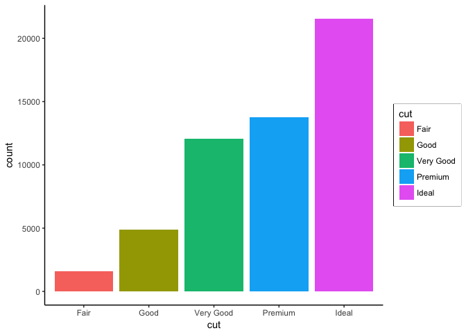

``` r
# remeber we have to tell r the element line, rect or text\
```

some scatter plot

``` r
mpg %>% 
  ggplot(aes(x = displ, y = hwy))+
  geom_point()+
  geom_smooth(color = "red", span = 0.2) # the smaller the span then the sliding widow will be very small!
```

    ## `geom_smooth()` using method = 'loess'

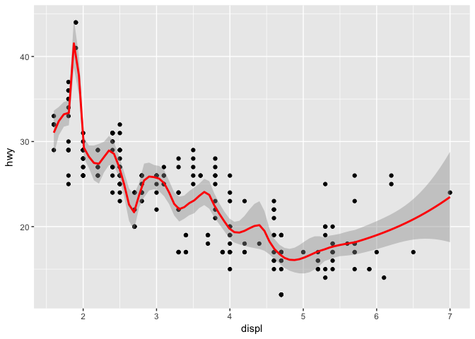

``` r
mpg %>% 
  ggplot(aes( x = displ))+
  geom_smooth( aes(y = hwy , color = "hwy"), size = 1.3, span = 100)+
  geom_smooth( aes(y = cty , color = "cty"), size = 1.3, span = 0.2)+
   geom_point(aes( y = cty), color = "red")+
  geom_point(aes(y=hwy), color = "blue")+
  theme_classic()+
  geom_hline(yintercept = mean(mpg$hwy))+
    geom_hline(yintercept = mean(mpg$cty))
```

    ## `geom_smooth()` using method = 'loess'
    ## `geom_smooth()` using method = 'loess'

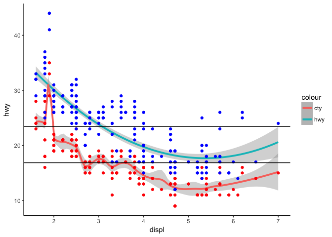

``` r
#If you speficy your asthetics at the begining, it is carried out for the rest of the layers. Now once we add a layer we can overright these aes **per** layer
```

now we can extract the the graphs
=================================

``` r
#ggsave()
```

### Here we work with some dplyr and gapminder

``` r
gapminder %>% 
  ggplot(aes( x = year, y = lifeExp, group = country))+
  geom_line(aes(color = continent), alpha = 0.5)+
  geom_point(alpha = 0.1)+
  theme_classic()+
  facet_wrap(~continent, ncol = 5)+
  theme(legend.box.background = element_rect(),
        strip.background = element_rect(fill = "orange"),
        axis.text.x = element_text(angle = 90))
```

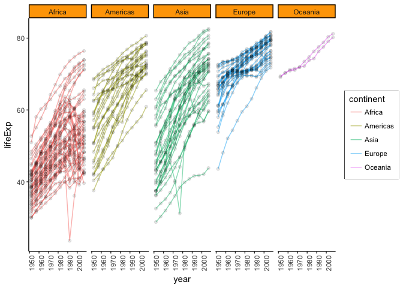

``` r
#remeber the theme only going to tweak the alredy established axis and all of that1

# for facet grid (rows~columns)
 #(if you see row ~ . ) the . is nothing  or we can even add multiple matrix combos (.~x1 + x2) 
```

faceting
========

``` r
mpg %>% 
  ggplot(aes( x = cyl, group = class, fill = class))+
  geom_histogram(binwidth = 1, color = "black")+
  facet_wrap(~class)+
  theme_bw()
```

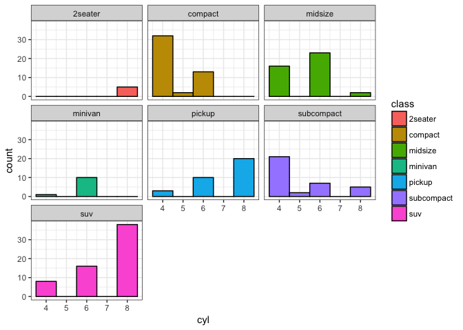

ggplot day 2
============

talks about scaling:

\#c("fixed", "free\_x", "free\_y", "free")) : 'arg' should be one of “fixed”, “free\_x”, “free\_y”, “free”

``` r
mpg %>% 
  ggplot(aes( x = cyl, group = class, fill = class))+
  geom_histogram(binwidth = 1, color = "black")+
  facet_wrap(~class, scales = "free_x")+
  theme_bw()
```

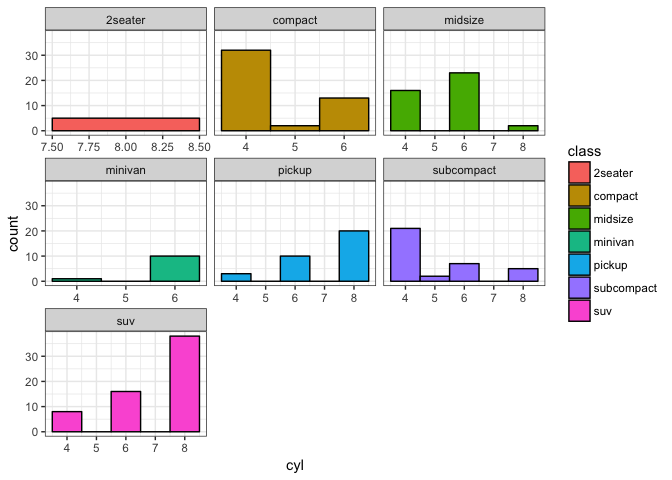

``` r
msleep %>% 
  ggplot(aes(x = sleep_cycle, y = sleep_total, color = vore)) +
  geom_point()+
  ggtitle("how things sleep")+
  xlab("Sleep Cycle")+
  ylab("Total amount of sleep")+
  scale_colour_manual( name = "Diet", #this will allow us to pick what we want in the legend
                       values = c("red", "blue", "green", "black"),
                       breaks = c("carni", "herbi", "insecti","omni"))
```

    ## Warning: Removed 52 rows containing missing values (geom_point).

 \# lets add some color:

``` r
display.brewer.all()
```


``` r
msleep %>% 
  ggplot(aes(x= brainwt, fill = vore))+
  geom_histogram(binwidth = 1 )+
  scale_x_log10()+
  scale_fill_brewer("RDGry")
```

    ## Warning: Removed 27 rows containing non-finite values (stat_bin).


how to work with positioning:
=============================

``` r
diamonds %>% 
  ggplot(aes(color, fill = cut))+
  geom_bar(position = "dodge")
```

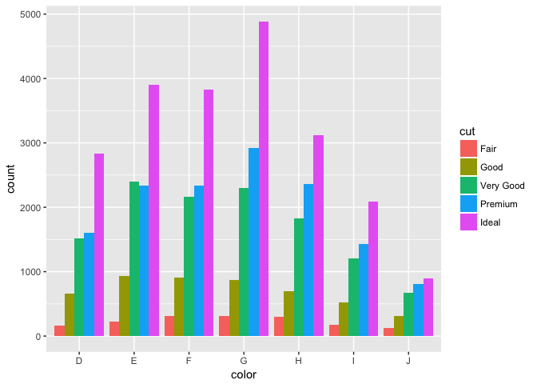

``` r
mpg %>% 
ggplot(aes(x= cty, y = hwy))+
  geom_point()+
  geom_text(aes(label = class ))+
  annotate("label", 15, 40, label = "this is not a drill") #the "lable" will give us a outlined box!
```

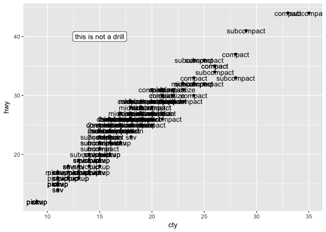 exercise:

``` r
msleep %>% 
  ggplot(aes(x = sleep_total, y =bodywt))+
  geom_text(aes(label = genus, color = genus))+
  scale_y_log10()+
  theme(legend.position = "")
```

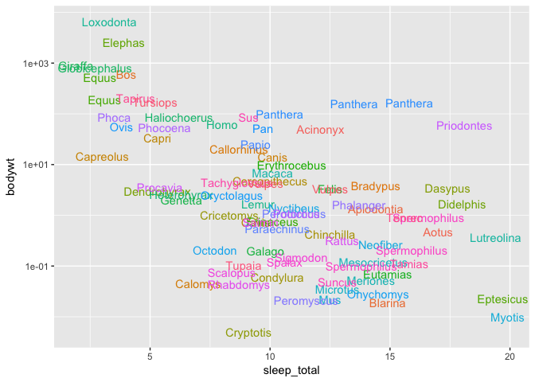

exerice with overplotting:
==========================

``` r
diamonds %>% 
  ggplot(aes(x = carat, y = price))+
  geom_point(alpha = 0.2)
```

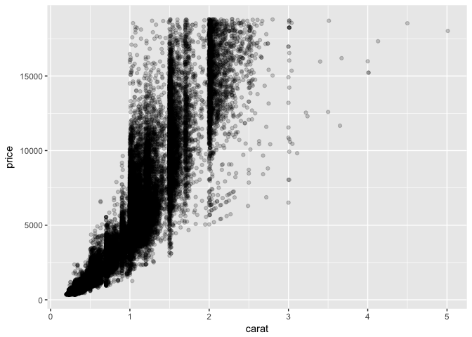

``` r
ggsave("plot.pdf", device = "pdf")
```

    ## Saving 7 x 5 in image


