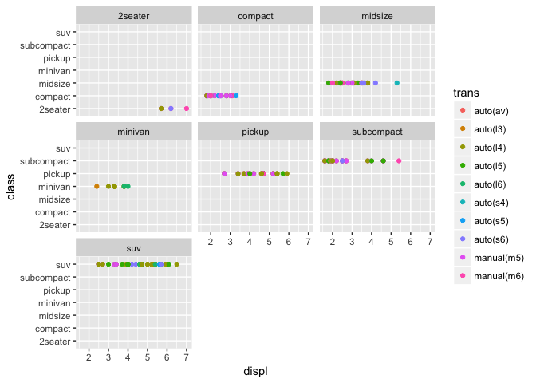

ggplot2\_tutorial\_2017
================
Chad Fibke
2017-10-13

``` r
library(tidyverse)
```

    ## Loading tidyverse: ggplot2
    ## Loading tidyverse: tibble
    ## Loading tidyverse: tidyr
    ## Loading tidyverse: readr
    ## Loading tidyverse: purrr
    ## Loading tidyverse: dplyr

    ## Conflicts with tidy packages ----------------------------------------------

    ## filter(): dplyr, stats
    ## lag():    dplyr, stats

``` r
library(gapminder)
```

Day.1 Oct13
===========

``` r
summary(mpg)
```

    ##  manufacturer          model               displ            year     
    ##  Length:234         Length:234         Min.   :1.600   Min.   :1999  
    ##  Class :character   Class :character   1st Qu.:2.400   1st Qu.:1999  
    ##  Mode  :character   Mode  :character   Median :3.300   Median :2004  
    ##                                        Mean   :3.472   Mean   :2004  
    ##                                        3rd Qu.:4.600   3rd Qu.:2008  
    ##                                        Max.   :7.000   Max.   :2008  
    ##       cyl           trans               drv                 cty       
    ##  Min.   :4.000   Length:234         Length:234         Min.   : 9.00  
    ##  1st Qu.:4.000   Class :character   Class :character   1st Qu.:14.00  
    ##  Median :6.000   Mode  :character   Mode  :character   Median :17.00  
    ##  Mean   :5.889                                         Mean   :16.86  
    ##  3rd Qu.:8.000                                         3rd Qu.:19.00  
    ##  Max.   :8.000                                         Max.   :35.00  
    ##       hwy             fl               class          
    ##  Min.   :12.00   Length:234         Length:234        
    ##  1st Qu.:18.00   Class :character   Class :character  
    ##  Median :24.00   Mode  :character   Mode  :character  
    ##  Mean   :23.44                                        
    ##  3rd Qu.:27.00                                        
    ##  Max.   :44.00

``` r
glimpse(mpg)
```

    ## Observations: 234
    ## Variables: 11
    ## $ manufacturer <chr> "audi", "audi", "audi", "audi", "audi", "audi", "...
    ## $ model        <chr> "a4", "a4", "a4", "a4", "a4", "a4", "a4", "a4 qua...
    ## $ displ        <dbl> 1.8, 1.8, 2.0, 2.0, 2.8, 2.8, 3.1, 1.8, 1.8, 2.0,...
    ## $ year         <int> 1999, 1999, 2008, 2008, 1999, 1999, 2008, 1999, 1...
    ## $ cyl          <int> 4, 4, 4, 4, 6, 6, 6, 4, 4, 4, 4, 6, 6, 6, 6, 6, 6...
    ## $ trans        <chr> "auto(l5)", "manual(m5)", "manual(m6)", "auto(av)...
    ## $ drv          <chr> "f", "f", "f", "f", "f", "f", "f", "4", "4", "4",...
    ## $ cty          <int> 18, 21, 20, 21, 16, 18, 18, 18, 16, 20, 19, 15, 1...
    ## $ hwy          <int> 29, 29, 31, 30, 26, 26, 27, 26, 25, 28, 27, 25, 2...
    ## $ fl           <chr> "p", "p", "p", "p", "p", "p", "p", "p", "p", "p",...
    ## $ class        <chr> "compact", "compact", "compact", "compact", "comp...

``` r
??mpg
mpg %>% 
  ggplot(aes( x = displ, y = cty))+ 
  geom_point()+
  theme_classic()+
  geom_rect(aes(xmin = 3, xmax = 4, ymin = 15, ymax = 20), alpha = 0.0001, color = "red")
```


``` r
# This can help to highlight any data!

#xmin - (required) left edge of rectangle
#xmax - (required) right edge of rectangle
#ymin - (required) bottom edge of rectangle
#ymax - (required) top edge of rectangle
#size - (default: 0.5) line width of the rectangle's outline
#linetype - (default: 1=solid) line type of the rectangle's outline
#color - (default: NA=no outline) color of the rectangle's outline
#fill - (default: "grey20") fill color of the rectangle
#alpha - (default: 1=opaque) transparency of the rectangle's fil
```

``` r
mpg %>% 
  ggplot(aes(x = displ, y = class, color = trans))+
  geom_point()+
  facet_wrap(~class)
```



``` r
#dimonds and cuts
glimpse(diamonds)   
```

    ## Observations: 53,940
    ## Variables: 10
    ## $ carat   <dbl> 0.23, 0.21, 0.23, 0.29, 0.31, 0.24, 0.24, 0.26, 0.22, ...
    ## $ cut     <ord> Ideal, Premium, Good, Premium, Good, Very Good, Very G...
    ## $ color   <ord> E, E, E, I, J, J, I, H, E, H, J, J, F, J, E, E, I, J, ...
    ## $ clarity <ord> SI2, SI1, VS1, VS2, SI2, VVS2, VVS1, SI1, VS2, VS1, SI...
    ## $ depth   <dbl> 61.5, 59.8, 56.9, 62.4, 63.3, 62.8, 62.3, 61.9, 65.1, ...
    ## $ table   <dbl> 55, 61, 65, 58, 58, 57, 57, 55, 61, 61, 55, 56, 61, 54...
    ## $ price   <int> 326, 326, 327, 334, 335, 336, 336, 337, 337, 338, 339,...
    ## $ x       <dbl> 3.95, 3.89, 4.05, 4.20, 4.34, 3.94, 3.95, 4.07, 3.87, ...
    ## $ y       <dbl> 3.98, 3.84, 4.07, 4.23, 4.35, 3.96, 3.98, 4.11, 3.78, ...
    ## $ z       <dbl> 2.43, 2.31, 2.31, 2.63, 2.75, 2.48, 2.47, 2.53, 2.49, ...

``` r
# so we will use a bar chart if we are looking at cut
diamonds %>% 
  ggplot(aes(x = cut, y = price))+
  geom_boxplot(aes(fill = cut))+
  theme_classic()+
  facet_wrap(~cut, scales = "free")
```


``` r
diamonds %>% 
  ggplot(aes(x = cut))+
  geom_bar(aes(fill = cut))+
  theme_classic()+
  theme(legend.box.background = element_rect()) 
```


``` r
# remeber we have to tell r the element line, rect or text\
```

some scatter plot

``` r
mpg %>% 
  ggplot(aes(x = displ, y = hwy))+
  geom_point()+
  geom_smooth(color = "red", span = 0.2) # the smaller the span then the sliding widow will be very small!
```

    ## `geom_smooth()` using method = 'loess'


``` r
mpg %>% 
  ggplot(aes( x = displ, y = cty))+
  geom_point()+
  geom_smooth(method = "lm", color = "red")+
  geom_smooth( mapping = aes(y = hwy), color = "red", size = 1.3, span = 100)
```

    ## `geom_smooth()` using method = 'loess'


``` r
  theme_classic()
```

    ## List of 57
    ##  $ line                 :List of 6
    ##   ..$ colour       : chr "black"
    ##   ..$ size         : num 0.5
    ##   ..$ linetype     : num 1
    ##   ..$ lineend      : chr "butt"
    ##   ..$ arrow        : logi FALSE
    ##   ..$ inherit.blank: logi TRUE
    ##   ..- attr(*, "class")= chr [1:2] "element_line" "element"
    ##  $ rect                 :List of 5
    ##   ..$ fill         : chr "white"
    ##   ..$ colour       : chr "black"
    ##   ..$ size         : num 0.5
    ##   ..$ linetype     : num 1
    ##   ..$ inherit.blank: logi TRUE
    ##   ..- attr(*, "class")= chr [1:2] "element_rect" "element"
    ##  $ text                 :List of 11
    ##   ..$ family       : chr ""
    ##   ..$ face         : chr "plain"
    ##   ..$ colour       : chr "black"
    ##   ..$ size         : num 11
    ##   ..$ hjust        : num 0.5
    ##   ..$ vjust        : num 0.5
    ##   ..$ angle        : num 0
    ##   ..$ lineheight   : num 0.9
    ##   ..$ margin       :Classes 'margin', 'unit'  atomic [1:4] 0 0 0 0
    ##   .. .. ..- attr(*, "valid.unit")= int 8
    ##   .. .. ..- attr(*, "unit")= chr "pt"
    ##   ..$ debug        : logi FALSE
    ##   ..$ inherit.blank: logi TRUE
    ##   ..- attr(*, "class")= chr [1:2] "element_text" "element"
    ##  $ axis.title.x         :List of 11
    ##   ..$ family       : NULL
    ##   ..$ face         : NULL
    ##   ..$ colour       : NULL
    ##   ..$ size         : NULL
    ##   ..$ hjust        : NULL
    ##   ..$ vjust        : num 1
    ##   ..$ angle        : NULL
    ##   ..$ lineheight   : NULL
    ##   ..$ margin       :Classes 'margin', 'unit'  atomic [1:4] 5.5 0 0 0
    ##   .. .. ..- attr(*, "valid.unit")= int 8
    ##   .. .. ..- attr(*, "unit")= chr "pt"
    ##   ..$ debug        : NULL
    ##   ..$ inherit.blank: logi TRUE
    ##   ..- attr(*, "class")= chr [1:2] "element_text" "element"
    ##  $ axis.title.x.top     :List of 11
    ##   ..$ family       : NULL
    ##   ..$ face         : NULL
    ##   ..$ colour       : NULL
    ##   ..$ size         : NULL
    ##   ..$ hjust        : NULL
    ##   ..$ vjust        : num 0
    ##   ..$ angle        : NULL
    ##   ..$ lineheight   : NULL
    ##   ..$ margin       :Classes 'margin', 'unit'  atomic [1:4] 0 0 5.5 0
    ##   .. .. ..- attr(*, "valid.unit")= int 8
    ##   .. .. ..- attr(*, "unit")= chr "pt"
    ##   ..$ debug        : NULL
    ##   ..$ inherit.blank: logi TRUE
    ##   ..- attr(*, "class")= chr [1:2] "element_text" "element"
    ##  $ axis.title.y         :List of 11
    ##   ..$ family       : NULL
    ##   ..$ face         : NULL
    ##   ..$ colour       : NULL
    ##   ..$ size         : NULL
    ##   ..$ hjust        : NULL
    ##   ..$ vjust        : num 1
    ##   ..$ angle        : num 90
    ##   ..$ lineheight   : NULL
    ##   ..$ margin       :Classes 'margin', 'unit'  atomic [1:4] 0 5.5 0 0
    ##   .. .. ..- attr(*, "valid.unit")= int 8
    ##   .. .. ..- attr(*, "unit")= chr "pt"
    ##   ..$ debug        : NULL
    ##   ..$ inherit.blank: logi TRUE
    ##   ..- attr(*, "class")= chr [1:2] "element_text" "element"
    ##  $ axis.title.y.right   :List of 11
    ##   ..$ family       : NULL
    ##   ..$ face         : NULL
    ##   ..$ colour       : NULL
    ##   ..$ size         : NULL
    ##   ..$ hjust        : NULL
    ##   ..$ vjust        : num 0
    ##   ..$ angle        : num -90
    ##   ..$ lineheight   : NULL
    ##   ..$ margin       :Classes 'margin', 'unit'  atomic [1:4] 0 0 0 5.5
    ##   .. .. ..- attr(*, "valid.unit")= int 8
    ##   .. .. ..- attr(*, "unit")= chr "pt"
    ##   ..$ debug        : NULL
    ##   ..$ inherit.blank: logi TRUE
    ##   ..- attr(*, "class")= chr [1:2] "element_text" "element"
    ##  $ axis.text            :List of 11
    ##   ..$ family       : NULL
    ##   ..$ face         : NULL
    ##   ..$ colour       : chr "grey30"
    ##   ..$ size         :Class 'rel'  num 0.8
    ##   ..$ hjust        : NULL
    ##   ..$ vjust        : NULL
    ##   ..$ angle        : NULL
    ##   ..$ lineheight   : NULL
    ##   ..$ margin       : NULL
    ##   ..$ debug        : NULL
    ##   ..$ inherit.blank: logi TRUE
    ##   ..- attr(*, "class")= chr [1:2] "element_text" "element"
    ##  $ axis.text.x          :List of 11
    ##   ..$ family       : NULL
    ##   ..$ face         : NULL
    ##   ..$ colour       : NULL
    ##   ..$ size         : NULL
    ##   ..$ hjust        : NULL
    ##   ..$ vjust        : num 1
    ##   ..$ angle        : NULL
    ##   ..$ lineheight   : NULL
    ##   ..$ margin       :Classes 'margin', 'unit'  atomic [1:4] 2.2 0 0 0
    ##   .. .. ..- attr(*, "valid.unit")= int 8
    ##   .. .. ..- attr(*, "unit")= chr "pt"
    ##   ..$ debug        : NULL
    ##   ..$ inherit.blank: logi TRUE
    ##   ..- attr(*, "class")= chr [1:2] "element_text" "element"
    ##  $ axis.text.x.top      :List of 11
    ##   ..$ family       : NULL
    ##   ..$ face         : NULL
    ##   ..$ colour       : NULL
    ##   ..$ size         : NULL
    ##   ..$ hjust        : NULL
    ##   ..$ vjust        : num 0
    ##   ..$ angle        : NULL
    ##   ..$ lineheight   : NULL
    ##   ..$ margin       :Classes 'margin', 'unit'  atomic [1:4] 0 0 2.2 0
    ##   .. .. ..- attr(*, "valid.unit")= int 8
    ##   .. .. ..- attr(*, "unit")= chr "pt"
    ##   ..$ debug        : NULL
    ##   ..$ inherit.blank: logi TRUE
    ##   ..- attr(*, "class")= chr [1:2] "element_text" "element"
    ##  $ axis.text.y          :List of 11
    ##   ..$ family       : NULL
    ##   ..$ face         : NULL
    ##   ..$ colour       : NULL
    ##   ..$ size         : NULL
    ##   ..$ hjust        : num 1
    ##   ..$ vjust        : NULL
    ##   ..$ angle        : NULL
    ##   ..$ lineheight   : NULL
    ##   ..$ margin       :Classes 'margin', 'unit'  atomic [1:4] 0 2.2 0 0
    ##   .. .. ..- attr(*, "valid.unit")= int 8
    ##   .. .. ..- attr(*, "unit")= chr "pt"
    ##   ..$ debug        : NULL
    ##   ..$ inherit.blank: logi TRUE
    ##   ..- attr(*, "class")= chr [1:2] "element_text" "element"
    ##  $ axis.text.y.right    :List of 11
    ##   ..$ family       : NULL
    ##   ..$ face         : NULL
    ##   ..$ colour       : NULL
    ##   ..$ size         : NULL
    ##   ..$ hjust        : num 0
    ##   ..$ vjust        : NULL
    ##   ..$ angle        : NULL
    ##   ..$ lineheight   : NULL
    ##   ..$ margin       :Classes 'margin', 'unit'  atomic [1:4] 0 0 0 2.2
    ##   .. .. ..- attr(*, "valid.unit")= int 8
    ##   .. .. ..- attr(*, "unit")= chr "pt"
    ##   ..$ debug        : NULL
    ##   ..$ inherit.blank: logi TRUE
    ##   ..- attr(*, "class")= chr [1:2] "element_text" "element"
    ##  $ axis.ticks           :List of 6
    ##   ..$ colour       : chr "grey20"
    ##   ..$ size         : NULL
    ##   ..$ linetype     : NULL
    ##   ..$ lineend      : NULL
    ##   ..$ arrow        : logi FALSE
    ##   ..$ inherit.blank: logi TRUE
    ##   ..- attr(*, "class")= chr [1:2] "element_line" "element"
    ##  $ axis.ticks.length    :Class 'unit'  atomic [1:1] 2.75
    ##   .. ..- attr(*, "valid.unit")= int 8
    ##   .. ..- attr(*, "unit")= chr "pt"
    ##  $ axis.line            :List of 6
    ##   ..$ colour       : chr "black"
    ##   ..$ size         : num 0.5
    ##   ..$ linetype     : NULL
    ##   ..$ lineend      : NULL
    ##   ..$ arrow        : logi FALSE
    ##   ..$ inherit.blank: logi TRUE
    ##   ..- attr(*, "class")= chr [1:2] "element_line" "element"
    ##  $ axis.line.x          : NULL
    ##  $ axis.line.y          : NULL
    ##  $ legend.background    :List of 5
    ##   ..$ fill         : NULL
    ##   ..$ colour       : logi NA
    ##   ..$ size         : NULL
    ##   ..$ linetype     : NULL
    ##   ..$ inherit.blank: logi TRUE
    ##   ..- attr(*, "class")= chr [1:2] "element_rect" "element"
    ##  $ legend.margin        :Classes 'margin', 'unit'  atomic [1:4] 0.2 0.2 0.2 0.2
    ##   .. ..- attr(*, "valid.unit")= int 1
    ##   .. ..- attr(*, "unit")= chr "cm"
    ##  $ legend.spacing       :Class 'unit'  atomic [1:1] 0.4
    ##   .. ..- attr(*, "valid.unit")= int 1
    ##   .. ..- attr(*, "unit")= chr "cm"
    ##  $ legend.spacing.x     : NULL
    ##  $ legend.spacing.y     : NULL
    ##  $ legend.key           : list()
    ##   ..- attr(*, "class")= chr [1:2] "element_blank" "element"
    ##  $ legend.key.size      :Class 'unit'  atomic [1:1] 1.2
    ##   .. ..- attr(*, "valid.unit")= int 3
    ##   .. ..- attr(*, "unit")= chr "lines"
    ##  $ legend.key.height    : NULL
    ##  $ legend.key.width     : NULL
    ##  $ legend.text          :List of 11
    ##   ..$ family       : NULL
    ##   ..$ face         : NULL
    ##   ..$ colour       : NULL
    ##   ..$ size         :Class 'rel'  num 0.8
    ##   ..$ hjust        : NULL
    ##   ..$ vjust        : NULL
    ##   ..$ angle        : NULL
    ##   ..$ lineheight   : NULL
    ##   ..$ margin       : NULL
    ##   ..$ debug        : NULL
    ##   ..$ inherit.blank: logi TRUE
    ##   ..- attr(*, "class")= chr [1:2] "element_text" "element"
    ##  $ legend.text.align    : NULL
    ##  $ legend.title         :List of 11
    ##   ..$ family       : NULL
    ##   ..$ face         : NULL
    ##   ..$ colour       : NULL
    ##   ..$ size         : NULL
    ##   ..$ hjust        : num 0
    ##   ..$ vjust        : NULL
    ##   ..$ angle        : NULL
    ##   ..$ lineheight   : NULL
    ##   ..$ margin       : NULL
    ##   ..$ debug        : NULL
    ##   ..$ inherit.blank: logi TRUE
    ##   ..- attr(*, "class")= chr [1:2] "element_text" "element"
    ##  $ legend.title.align   : NULL
    ##  $ legend.position      : chr "right"
    ##  $ legend.direction     : NULL
    ##  $ legend.justification : chr "center"
    ##  $ legend.box           : NULL
    ##  $ legend.box.margin    :Classes 'margin', 'unit'  atomic [1:4] 0 0 0 0
    ##   .. ..- attr(*, "valid.unit")= int 1
    ##   .. ..- attr(*, "unit")= chr "cm"
    ##  $ legend.box.background: list()
    ##   ..- attr(*, "class")= chr [1:2] "element_blank" "element"
    ##  $ legend.box.spacing   :Class 'unit'  atomic [1:1] 0.4
    ##   .. ..- attr(*, "valid.unit")= int 1
    ##   .. ..- attr(*, "unit")= chr "cm"
    ##  $ panel.background     :List of 5
    ##   ..$ fill         : chr "white"
    ##   ..$ colour       : logi NA
    ##   ..$ size         : NULL
    ##   ..$ linetype     : NULL
    ##   ..$ inherit.blank: logi TRUE
    ##   ..- attr(*, "class")= chr [1:2] "element_rect" "element"
    ##  $ panel.border         : list()
    ##   ..- attr(*, "class")= chr [1:2] "element_blank" "element"
    ##  $ panel.spacing        :Class 'unit'  atomic [1:1] 5.5
    ##   .. ..- attr(*, "valid.unit")= int 8
    ##   .. ..- attr(*, "unit")= chr "pt"
    ##  $ panel.spacing.x      : NULL
    ##  $ panel.spacing.y      : NULL
    ##  $ panel.grid.major     : list()
    ##   ..- attr(*, "class")= chr [1:2] "element_blank" "element"
    ##  $ panel.grid.minor     : list()
    ##   ..- attr(*, "class")= chr [1:2] "element_blank" "element"
    ##  $ panel.ontop          : logi FALSE
    ##  $ plot.background      :List of 5
    ##   ..$ fill         : NULL
    ##   ..$ colour       : chr "white"
    ##   ..$ size         : NULL
    ##   ..$ linetype     : NULL
    ##   ..$ inherit.blank: logi TRUE
    ##   ..- attr(*, "class")= chr [1:2] "element_rect" "element"
    ##  $ plot.title           :List of 11
    ##   ..$ family       : NULL
    ##   ..$ face         : NULL
    ##   ..$ colour       : NULL
    ##   ..$ size         :Class 'rel'  num 1.2
    ##   ..$ hjust        : num 0
    ##   ..$ vjust        : num 1
    ##   ..$ angle        : NULL
    ##   ..$ lineheight   : NULL
    ##   ..$ margin       :Classes 'margin', 'unit'  atomic [1:4] 0 0 6.6 0
    ##   .. .. ..- attr(*, "valid.unit")= int 8
    ##   .. .. ..- attr(*, "unit")= chr "pt"
    ##   ..$ debug        : NULL
    ##   ..$ inherit.blank: logi TRUE
    ##   ..- attr(*, "class")= chr [1:2] "element_text" "element"
    ##  $ plot.subtitle        :List of 11
    ##   ..$ family       : NULL
    ##   ..$ face         : NULL
    ##   ..$ colour       : NULL
    ##   ..$ size         :Class 'rel'  num 0.9
    ##   ..$ hjust        : num 0
    ##   ..$ vjust        : num 1
    ##   ..$ angle        : NULL
    ##   ..$ lineheight   : NULL
    ##   ..$ margin       :Classes 'margin', 'unit'  atomic [1:4] 0 0 4.95 0
    ##   .. .. ..- attr(*, "valid.unit")= int 8
    ##   .. .. ..- attr(*, "unit")= chr "pt"
    ##   ..$ debug        : NULL
    ##   ..$ inherit.blank: logi TRUE
    ##   ..- attr(*, "class")= chr [1:2] "element_text" "element"
    ##  $ plot.caption         :List of 11
    ##   ..$ family       : NULL
    ##   ..$ face         : NULL
    ##   ..$ colour       : NULL
    ##   ..$ size         :Class 'rel'  num 0.9
    ##   ..$ hjust        : num 1
    ##   ..$ vjust        : num 1
    ##   ..$ angle        : NULL
    ##   ..$ lineheight   : NULL
    ##   ..$ margin       :Classes 'margin', 'unit'  atomic [1:4] 4.95 0 0 0
    ##   .. .. ..- attr(*, "valid.unit")= int 8
    ##   .. .. ..- attr(*, "unit")= chr "pt"
    ##   ..$ debug        : NULL
    ##   ..$ inherit.blank: logi TRUE
    ##   ..- attr(*, "class")= chr [1:2] "element_text" "element"
    ##  $ plot.margin          :Classes 'margin', 'unit'  atomic [1:4] 5.5 5.5 5.5 5.5
    ##   .. ..- attr(*, "valid.unit")= int 8
    ##   .. ..- attr(*, "unit")= chr "pt"
    ##  $ strip.background     :List of 5
    ##   ..$ fill         : chr "white"
    ##   ..$ colour       : chr "black"
    ##   ..$ size         : num 1
    ##   ..$ linetype     : NULL
    ##   ..$ inherit.blank: logi TRUE
    ##   ..- attr(*, "class")= chr [1:2] "element_rect" "element"
    ##  $ strip.placement      : chr "inside"
    ##  $ strip.text           :List of 11
    ##   ..$ family       : NULL
    ##   ..$ face         : NULL
    ##   ..$ colour       : chr "grey10"
    ##   ..$ size         :Class 'rel'  num 0.8
    ##   ..$ hjust        : NULL
    ##   ..$ vjust        : NULL
    ##   ..$ angle        : NULL
    ##   ..$ lineheight   : NULL
    ##   ..$ margin       : NULL
    ##   ..$ debug        : NULL
    ##   ..$ inherit.blank: logi TRUE
    ##   ..- attr(*, "class")= chr [1:2] "element_text" "element"
    ##  $ strip.text.x         :List of 11
    ##   ..$ family       : NULL
    ##   ..$ face         : NULL
    ##   ..$ colour       : NULL
    ##   ..$ size         : NULL
    ##   ..$ hjust        : NULL
    ##   ..$ vjust        : NULL
    ##   ..$ angle        : NULL
    ##   ..$ lineheight   : NULL
    ##   ..$ margin       :Classes 'margin', 'unit'  atomic [1:4] 5.5 0 5.5 0
    ##   .. .. ..- attr(*, "valid.unit")= int 8
    ##   .. .. ..- attr(*, "unit")= chr "pt"
    ##   ..$ debug        : NULL
    ##   ..$ inherit.blank: logi TRUE
    ##   ..- attr(*, "class")= chr [1:2] "element_text" "element"
    ##  $ strip.text.y         :List of 11
    ##   ..$ family       : NULL
    ##   ..$ face         : NULL
    ##   ..$ colour       : NULL
    ##   ..$ size         : NULL
    ##   ..$ hjust        : NULL
    ##   ..$ vjust        : NULL
    ##   ..$ angle        : num -90
    ##   ..$ lineheight   : NULL
    ##   ..$ margin       :Classes 'margin', 'unit'  atomic [1:4] 0 5.5 0 5.5
    ##   .. .. ..- attr(*, "valid.unit")= int 8
    ##   .. .. ..- attr(*, "unit")= chr "pt"
    ##   ..$ debug        : NULL
    ##   ..$ inherit.blank: logi TRUE
    ##   ..- attr(*, "class")= chr [1:2] "element_text" "element"
    ##  $ strip.switch.pad.grid:Class 'unit'  atomic [1:1] 0.1
    ##   .. ..- attr(*, "valid.unit")= int 1
    ##   .. ..- attr(*, "unit")= chr "cm"
    ##  $ strip.switch.pad.wrap:Class 'unit'  atomic [1:1] 0.1
    ##   .. ..- attr(*, "valid.unit")= int 1
    ##   .. ..- attr(*, "unit")= chr "cm"
    ##  - attr(*, "class")= chr [1:2] "theme" "gg"
    ##  - attr(*, "complete")= logi TRUE
    ##  - attr(*, "validate")= logi TRUE

``` r
#or
mpg %>% 
  ggplot(aes( x = displ))+
  geom_smooth( aes(y = hwy , color = "hwy"), size = 1.3, span = 100)+
  geom_smooth( aes(y = cty , color = "cty"), size = 1.3, span = 0.2)+
   geom_point(aes( y = cty), color = "red")+
  geom_point(aes(y=hwy), color = "blue")+
  theme_classic()+
  geom_hline(yintercept = mean(mpg$hwy))+
    geom_hline(yintercept = mean(mpg$cty))
```

    ## `geom_smooth()` using method = 'loess'
    ## `geom_smooth()` using method = 'loess'


``` r
#If you speficy your asthetics at the begining, it is carried out for the rest of the layers. Now once we add a layer we can overright these aes **per** layer
```

now we can extract the the graphs
=================================

``` r
#ggsave()
```

### Here we work with some dplyr and gapminder

``` r
gapminder %>% 
  ggplot(aes( x = year, y = lifeExp, group = country))+
  geom_line(aes(color = continent), alpha = 0.5)+
  geom_point(alpha = 0.1)+
  theme_classic()+
  facet_wrap(~continent, ncol = 5)+
  theme(legend.box.background = element_rect(),
        strip.background = element_rect(fill = "orange"),
        axis.text.x = element_text(angle = 90))
```


``` r
#remeber the theme only going to tweak the alredy established axis and all of that1
```
